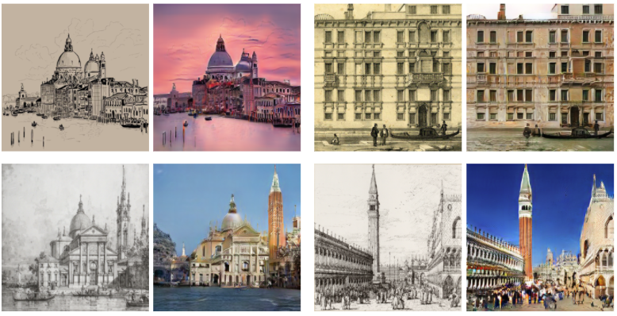
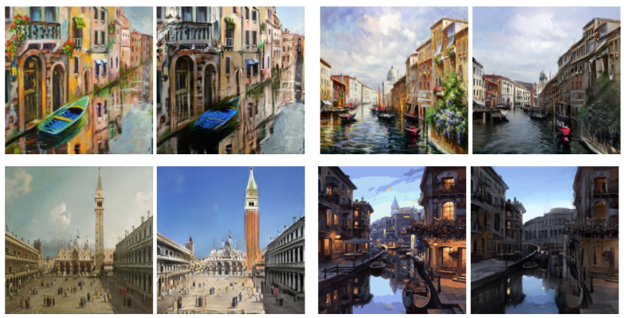
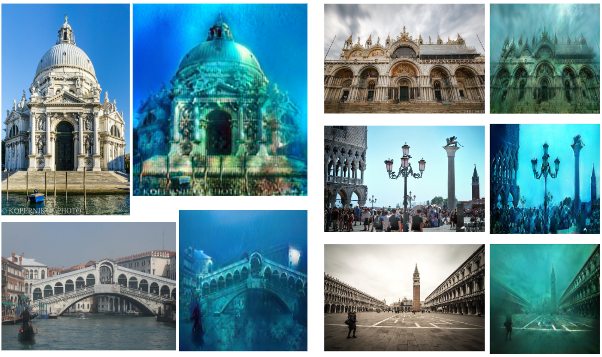

# DoGANa: A Venice CUT model

***Note**: The code in this project borrows heavily from the [PyTorch implementation of CUT](https://github.com/taesungp/contrastive-unpaired-translation)*

The purpose of this project is to transform the different ways we visualize Venice. We propose three implementations in this project:

- Photorealistic Venice:
  - Monochrome drawings/paintings -> photos (model name: `bwPhotoF`)
  - Colour paintings -> photos (model name: `cPhotoF`)
- Underwater Venice:
  - Photos -> underwater rendering of the photos (model name: `underwater`)

Here are some input/output pairs of each of the models:

<p align="center">
  
  <br>
    <em>Fig. 1: Monochrome model sample results (left: input monochrome drawing/painting, right: photorealistic rendering)</em>
</p>

<p align="center">
  
  <br>
    <em>Fig. 2: Color model sample results (left: input color painting, right: photorealistic rendering)</em>
</p>

<p align="center">
  
  <br>
    <em>Fig. 3: Underwater model sample results (left: input photo, right: underwater rendering of photo)</em>
</p>

## Getting started

### Prerequisites

- Linux or macOS
- Python 3
- CPU or NVIDIA GPU + CUDA CuDNN

### Requirements

#### Using Conda

Run the following command to set up the requirements in `Model/`:

```
conda env create -f environment.yml
```

You can now activate the environment by running `conda activate dogana`. Deactivate the environment using `conda deactivate`.

#### Using pip

Run the following command to set up the requirements in `Model/`:

```
pip install -r requirements.txt
```

#### Preparing data

There are no requirements on image sizes for training or testing. However, if you are using web scraped images, make sure 
to do the following before training your model:

- remove watermarks
- crop out frames

For example:

Original image             |  Cropped frame (ready for use)
:-------------------------:|:-------------------------:
  |  

### Data directory format
<a name="dataformat"></a>

First, prepare your training data in a directory, in the following structure (the image names do not matter, as long as images are in a jpg/png format):

```
DATA_DIR
├── trainA            # contains input images
│   ├── img1.jpg 
│   ├── img2.jpg 
│   └── ...
└── trainB            # contains output images
    ├── img300.jpg 
    ├── img301.jpg 
    └── ...
```

You can use the same directory for training or testing. Alternatively, you can prepare a separate directory to test, in the same folder structure as specified above.

### Training

To train a model, simply run `python train.py --dataroot [DATA_DIR] --name [MODEL_NAME]`. To access modifiable training parameters, run `python train.py --help`.

The training script including modified parameters used for `cPhotoF` model is the following:

```
python train.py --dataroot [DATA_DIR] --name cPhotoF --CUT_mode CUT --n_epochs 150 --n_epochs_decay 300 --batch_size 4 --selfAttn 1 --normG spectral --edgeLoss 0.4 --canny1 350 --canny2 400 --lr 0.00018 --normD batch
```

The training script including modified parameters used for `bwPhotoF` model is the following:

```
python train.py --dataroot [DATA_DIR] --name bwPhotoF --CUT_mode CUT --n_epochs 150 --n_epochs_decay 300 --batch_size 4 --selfAttn 1 --normG spectral --edgeLoss 0.4 --canny1 350 --canny2 400 --lr 0.00018 --normD batch
```

The training script including modified parameters used for `underwater` model is the following:

```
python train.py --dataroot [DATA_DIR] --name underwater --CUT_mode CUT --lr 0.0001 --canny1 300 --canny2 400 --edgeLoss 0.7 --n_epochs 150 --n_epochs_decay 250 --normG spectral --normD batch --batch_size 4
```

### Testing

To test the models, first prepare the test data input in a directory `DATA_DIR`, as specified in the [Data format section](#dataformat).

To test a model, run:

```
python test_dogana.py --dataroot [DATA_DIR] --results_dir [RESULTS_DIR] --name [MODEL_NAME]
```

If you do not specify `results_dir`, the output results will be saved in `results/`.

The parameter `name` specifies which of the three models you would like to test. The options are: `bwPhotoF`, `cPhotoF`, `underwater`.

To access more testing parameters, run `python test_dogana.py --help`.

### Application 

We have provided a progressive web application for testing the models with a front end rather than through the command line.

In order to use the app, the user must have the ionic framework and php installed on their machine. Then simply instantiate a default php server in the directory `App/Dogana-Demo/src/asset/PHP/` with `php -S localhost:8000`. 

Then, return to the `Dogana-Demo` directory and run  `ionic serve`. This will automatically start the web server on your local machine and allow you to play with all 3 models using our demo images or your own. 
